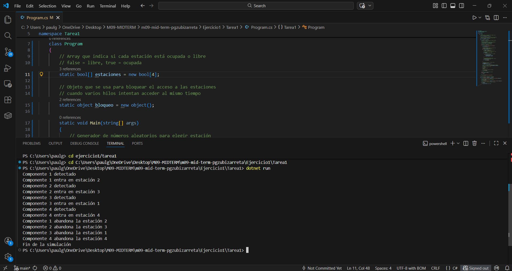
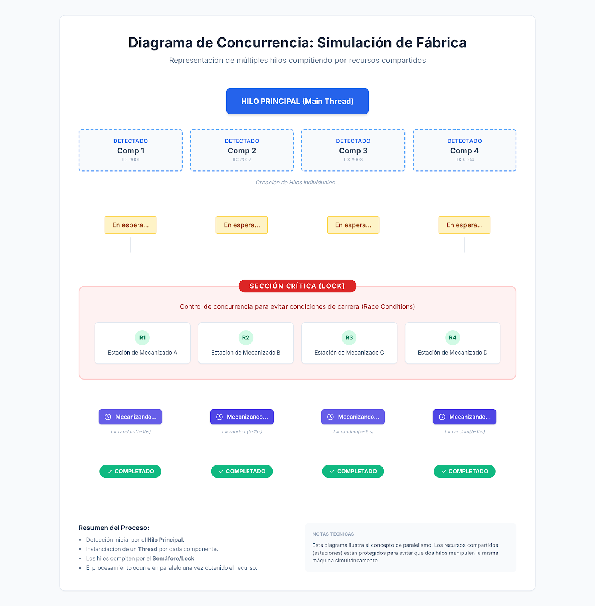

# Ejercicio 1 – Tarea 1

## Descripción

En esta tarea se simula el funcionamiento de una planta de fabricación con varias estaciones de mecanizado.

El sistema recibe componentes que deben ser procesados en una de las estaciones disponibles. Cada componente llega al sistema cada 2 segundos y se le asigna una estación de forma aleatoria.

Cada estación solo puede procesar un componente al mismo tiempo. Si una estación está ocupada, el componente deberá esperar hasta que una estación quede libre.

El tiempo de mecanizado de cada componente es de 10 segundos.

Para simular el funcionamiento del sistema se utilizan **hilos (threads)**, de forma que varios componentes pueden estar siendo procesados simultáneamente en diferentes estaciones.

---

# Funcionamiento del programa

El programa realiza los siguientes pasos:

1. Se detecta la llegada de un componente cada 2 segundos.
2. Cuando llega un componente se busca una estación libre.
3. La estación se elige de forma aleatoria.
4. Si la estación está ocupada, el componente espera hasta encontrar una libre.
5. Cuando encuentra una estación libre entra en ella.
6. El mecanizado dura 10 segundos.
7. Cuando el mecanizado termina, el componente abandona la estación.
8. La estación vuelve a quedar libre para procesar otro componente.

El procesamiento de cada componente se ejecuta en un **hilo independiente**, permitiendo que varios componentes se procesen al mismo tiempo.

---

# Uso de concurrencia

El programa utiliza **hilos (`Thread`)** para simular el procesamiento de los componentes en paralelo.

Cada componente crea un hilo que ejecuta el método `Procesar`.

Además, se utiliza la instrucción **`lock`** para evitar que dos hilos intenten ocupar la misma estación al mismo tiempo.

Esto garantiza que cada estación solo procese **un componente simultáneamente**.

---

# Preguntas

## ¿Cuántos hilos se están ejecutando en este programa?

En el programa se ejecuta un hilo principal y un hilo adicional por cada componente que se procesa.

En esta simulación hay 4 componentes, por lo que se crean 4 hilos de mecanizado.

En total se ejecutan:

- 1 hilo principal (Main)
- 4 hilos de mecanizado

Por lo tanto, se ejecutan **5 hilos en total**.

---

## ¿Cuál de los componentes entra primero en una estación de mecanizado?

El componente 1 entra primero en una estación de mecanizado.

Esto ocurre porque es el primer componente que llega al sistema y, al inicio del programa, todas las estaciones están libres.

Por lo tanto, puede entrar inmediatamente en una estación disponible.

---

## ¿Cuál de los componentes sale primero de la estación?

Normalmente el componente 1 será el primero en salir de la estación de mecanizado.

Esto ocurre porque es el primero en entrar y todos los componentes tienen el mismo tiempo de mecanizado (10 segundos).

Como todos tardan el mismo tiempo, el que entra antes suele terminar antes.

---

# Captura de ejecución

A continuación se muestra un ejemplo de ejecución del programa:

## Captura de ejecución

---

# Diagrama/Esquema

