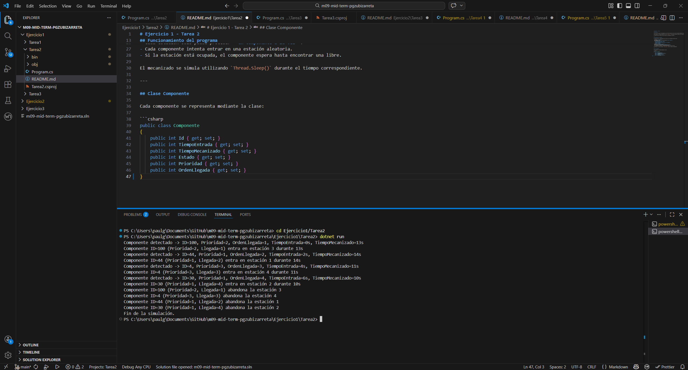

# Ejercicio 1 - Tarea 2

## Descripción

En esta tarea se amplía la simulación de la línea de mecanizado de la fábrica. Cada componente ya no es solo un elemento que entra en una estación, sino que ahora contiene información propia que afecta a su comportamiento durante la simulación.

En este programa se simula la llegada de 4 componentes a la planta, entrando uno cada 2 segundos. Cada componente dispone de:

- Un ID aleatorio entre 1 y 100.
- Un tiempo de entrada.
- Un tiempo de mecanizado aleatorio entre 5 y 15 segundos.
- Un estado del proceso.

Además, cada componente es procesado en una de las 4 estaciones de mecanizado disponibles. Si una estación está ocupada, el programa sigue intentando encontrar una libre hasta poder asignarla.

---

# Objetivo del programa

El objetivo de esta tarea es representar componentes con información propia y simular su paso por una línea de producción automatizada utilizando hilos en C#.

Cada componente pasa por distintos estados durante su ciclo en la línea de producción:

- En espera  
- En mecanizado  
- Completado  

El programa muestra por consola información sobre cada componente durante toda la simulación, como su orden de llegada, su identificador, el tiempo de mecanizado y la estación en la que está siendo procesado.

---

# Estructura del programa

El programa se divide principalmente en dos partes:

## Clase Componente

Esta clase representa cada pieza que llega a la línea de producción.

Cada componente contiene:

- Un identificador único generado aleatoriamente.
- Un tiempo de entrada en la línea.
- Un tiempo de mecanizado que determina cuánto tarda en procesarse.
- Un estado que indica en qué fase del proceso se encuentra.

Cuando se crea un componente, su estado inicial siempre es **En espera**.

---

## Clase principal del programa

La clase principal gestiona toda la simulación del sistema.

En ella se definen:

- Las **4 estaciones de mecanizado disponibles**.
- Un **mecanismo de bloqueo** para evitar que varios hilos utilicen la misma estación al mismo tiempo.
- La **creación de los componentes** que llegan a la línea de producción.
- La **asignación de estaciones libres**.
- La **ejecución de los hilos de mecanizado**.

Cada componente es procesado en un hilo independiente para simular que varios componentes pueden mecanizarse simultáneamente.

---

# Funcionamiento de la simulación

El programa sigue los siguientes pasos:

1. Se generan 4 componentes que representan piezas que llegan a la fábrica.
2. Cada componente llega con un intervalo de 2 segundos respecto al anterior.
3. A cada componente se le asigna:
   - Un ID aleatorio entre 1 y 100.
   - Un tiempo de entrada en la línea.
   - Un tiempo de mecanizado aleatorio entre 5 y 15 segundos.
4. El sistema busca una estación libre entre las cuatro disponibles.
5. Cuando encuentra una estación disponible:
   - Se reserva la estación.
   - Se crea un hilo que simula el mecanizado.
6. El hilo espera el tiempo indicado por el tiempo de mecanizado.
7. Cuando el proceso termina:
   - El estado del componente cambia a **Completado**.
   - La estación queda libre para otro componente.

---

# Uso de concurrencia

Para simular el funcionamiento real de una línea de producción, el programa utiliza **hilos (threads)**.

Esto permite que varios componentes se procesen al mismo tiempo en diferentes estaciones.

Para evitar errores cuando varios hilos intentan acceder a las estaciones simultáneamente, se utiliza un **bloqueo de sincronización**. De esta forma se garantiza que solo un hilo pueda modificar el estado de una estación en un momento determinado.

---

# Ejemplo de ejecución

Durante la ejecución del programa se muestran mensajes por consola indicando el progreso de cada componente en la línea de producción.

Se muestra información como:

- Orden de llegada del componente
- Identificador del componente
- Tiempo de mecanizado
- Estación asignada
- Cambio de estado del componente

Esto permite seguir paso a paso cómo avanza cada pieza por la línea de mecanizado.

---

# Respuesta a la pregunta del enunciado

## ¿Cuál de los componentes sale primero de una línea de producción? Explica tu respuesta.

El componente que sale primero es aquel que tiene el menor tiempo de mecanizado y que ha podido acceder a una estación de mecanizado sin retrasos adicionales.

Como el tiempo de mecanizado se genera de forma aleatoria entre 5 y 15 segundos, no se puede determinar previamente cuál será el primer componente en terminar.

Por lo tanto, el orden de salida dependerá de los valores aleatorios generados en cada ejecución del programa.

---

# Captura de ejecución

---

# Conclusión

Este programa simula de forma sencilla el funcionamiento de una línea de producción con múltiples estaciones de mecanizado.

Gracias al uso de hilos, es posible representar el procesamiento simultáneo de varios componentes, mientras que el uso de mecanismos de sincronización garantiza que las estaciones se utilicen correctamente sin conflictos entre procesos.

La simulación permite observar cómo cada componente entra en la línea, se mecaniza durante un tiempo determinado y finalmente abandona la estación una vez completado el proceso.