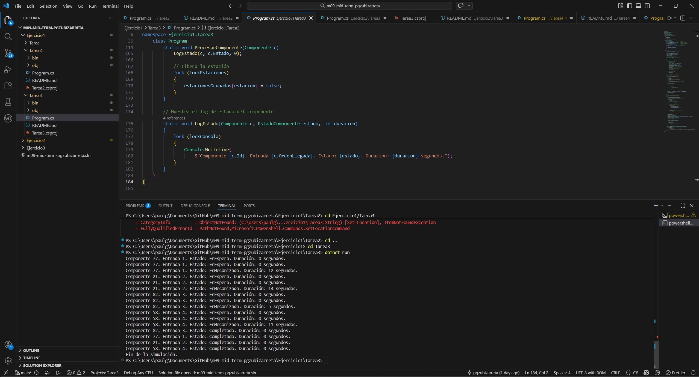
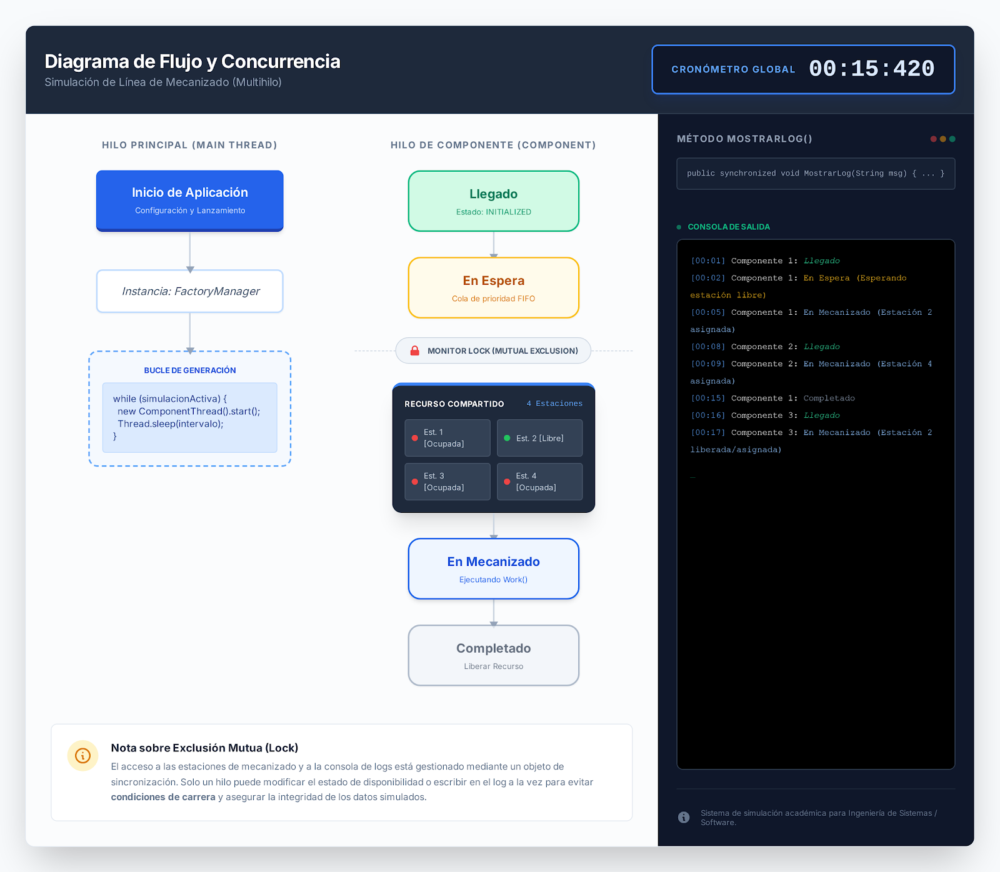

# Ejercicio 1 - Tarea 3

## Descripción

En esta tarea se mejora la simulación de la línea de mecanizado añadiendo un sistema de registro de eventos (logs) que permite observar con más detalle el comportamiento de cada componente dentro del sistema.

Cada componente que entra en la línea de producción pasa por diferentes estados durante su ciclo de vida:

- Llegado
- En espera
- En mecanizado
- Completado

El programa registra en consola cada uno de estos cambios junto con la duración del proceso correspondiente.

---

# Objetivo del programa

El objetivo de esta tarea es simular de forma más realista el funcionamiento de una línea de producción mediante el uso de **hilos concurrentes** y un **sistema de registro de eventos**.

El sistema debe mostrar claramente:

- cuándo llega cada componente
- cuánto tiempo permanece esperando
- cuánto dura el proceso de mecanizado
- cuándo finaliza el procesamiento

Esto permite analizar el comportamiento del sistema y comprender mejor cómo funcionan los procesos concurrentes.

---

# Estructura del programa

El programa se organiza en dos partes principales.

---

## Clase Componente

La clase `Componente` representa cada pieza que entra en la línea de producción.

Cada componente contiene la siguiente información:

- **ID**: identificador único generado aleatoriamente entre 1 y 100.
- **TiempoEntrada**: momento en el que el componente entra al sistema.
- **TiempoMecanizado**: tiempo que el componente permanece en mecanizado.
- **Estado**: indica la fase actual del proceso.

El estado del componente puede ser:

- En espera
- En mecanizado
- Completado

---

## Clase principal del programa

La clase principal se encarga de gestionar toda la simulación.

En ella se definen:

- Las **4 estaciones de mecanizado disponibles**
- Un **objeto de bloqueo** para controlar el acceso concurrente
- Un **cronómetro global** para medir tiempos de espera
- La **creación de los componentes**
- La **gestión de los hilos de mecanizado**

---

# Funcionamiento de la simulación

El funcionamiento del programa sigue los siguientes pasos:

1. Se inicia un cronómetro global para medir los tiempos de espera.
2. Se generan cuatro componentes que representan piezas que llegan a la línea de producción.
3. Cada componente llega con una diferencia de **2 segundos** respecto al anterior.
4. Cuando un componente llega:
   - se registra el evento de llegada
   - comienza la búsqueda de una estación libre
5. Si todas las estaciones están ocupadas, el componente entra en **estado de espera**.
6. Cuando encuentra una estación disponible:
   - se registra el tiempo de espera
   - se inicia el proceso de mecanizado
7. El mecanizado se simula utilizando una pausa equivalente al tiempo de mecanizado del componente.
8. Cuando el mecanizado termina:
   - el componente pasa al estado **Completado**
   - la estación queda libre para otro componente.

---

# Uso de concurrencia

Para simular el funcionamiento real de una línea de producción, el programa utiliza **hilos (threads)**.

Cada componente se procesa en un hilo independiente, lo que permite que varios componentes se mecanicen al mismo tiempo en distintas estaciones.

Para evitar que dos hilos utilicen la misma estación simultáneamente, se utiliza un mecanismo de sincronización mediante **bloqueo (lock)**.

Esto garantiza que la asignación y liberación de estaciones se realice de forma segura.

---

# Sistema de registro de eventos

El programa incluye un sistema de registro que muestra por consola el estado de cada componente durante la simulación.

Cada registro contiene:

- el identificador del componente
- el orden de entrada
- el estado actual
- la duración del proceso asociado

Esto permite visualizar claramente la evolución de cada componente dentro del sistema.

---

# Captura de ejecución

---

# Diagrama/Esquema

