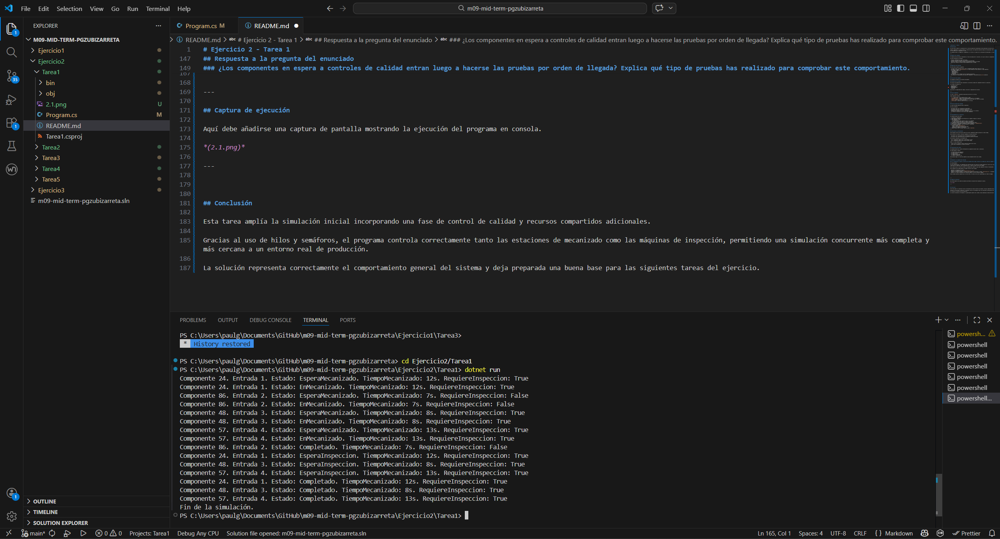

# Ejercicio 2 - Tarea 1

## Descripción

En esta tarea se amplía la simulación de la línea de producción incorporando una fase adicional de control de calidad.

Algunos componentes, de forma aleatoria, necesitan pasar una inspección adicional después del mecanizado. Para ello, la planta dispone de 2 máquinas de control de calidad, y cada una solo puede ser utilizada por un componente a la vez.

El programa simula la llegada de 4 componentes a la fábrica y su paso por las estaciones de mecanizado y, en algunos casos, por la fase de inspección.

---

## Objetivo del programa

El objetivo de esta tarea es representar un flujo de producción más realista, en el que no todos los componentes terminan directamente tras el mecanizado.

Con esta simulación se pretende:

- Procesar componentes de forma concurrente.
- Controlar el acceso limitado a las estaciones de mecanizado.
- Controlar también el acceso limitado a las máquinas de control de calidad.
- Mostrar por consola el avance de cada componente según su estado.

---

## Requisitos del enunciado

En esta tarea se pide lo siguiente:

- La planta tiene 2 máquinas de QC y solo un componente puede ocupar cada una a la vez.
- Se añade el atributo `requiereInspeccion` de tipo booleano de forma aleatoria a cada componente.
- Los estados se amplían a:
  - EsperaMecanizado
  - EnMecanizado
  - EsperaInspeccion
  - Completado
- La inspección dura un tiempo fijo de 15 segundos adicionales.
- Se actualiza la visualización del avance del componente. :contentReference[oaicite:2]{index=2}

---

## Estructura del programa

El programa se divide en tres partes principales.

### Enumeración de estados

Se utiliza una enumeración para representar los distintos estados del componente durante la simulación.

Los estados utilizados son:

- EsperaMecanizado
- EnMecanizado
- EsperaInspeccion
- Completado

Esto mejora la legibilidad del código y facilita el seguimiento del proceso.

---

### Clase Componente

La clase `Componente` representa cada pieza que entra en la fábrica.

Cada componente contiene:

- `Id`: identificador único aleatorio entre 1 y 100.
- `TiempoMecanizado`: tiempo de mecanizado aleatorio entre 5 y 15 segundos.
- `RequiereInspeccion`: indica si el componente necesita pasar por control de calidad.
- `Estado`: estado actual del componente.
- `OrdenLlegada`: número de orden de entrada a la fábrica.

---

### Clase principal del programa

La clase principal gestiona toda la simulación.

En ella se definen:

- Un semáforo para las 4 estaciones de mecanizado.
- Un semáforo para las 2 máquinas de control de calidad.
- Un generador aleatorio para crear componentes.
- Bloqueos para proteger el acceso al generador aleatorio y a la consola.
- La creación y ejecución de los hilos de cada componente.

---

## Funcionamiento de la simulación

El programa sigue estos pasos:

1. Se generan 4 componentes.
2. Cada componente llega con una diferencia de 2 segundos respecto al anterior.
3. Cada componente recibe:
   - un ID aleatorio,
   - un tiempo de mecanizado aleatorio entre 5 y 15 segundos,
   - un valor aleatorio que indica si requiere inspección.
4. El componente espera a que haya una estación de mecanizado libre.
5. Cuando entra en mecanizado, permanece el tiempo indicado en `TiempoMecanizado`.
6. Si no requiere inspección, pasa directamente a completado.
7. Si requiere inspección:
   - pasa al estado `EsperaInspeccion`,
   - espera a que haya una máquina de QC libre,
   - permanece 15 segundos en inspección.
8. Cuando termina todo el proceso, pasa al estado `Completado`.

---

## Concurrencia y sincronización

Este programa utiliza hilos para simular que varios componentes pueden procesarse al mismo tiempo.

Para controlar el acceso a recursos limitados se utilizan semáforos:

- Un semáforo con 4 posiciones para las estaciones de mecanizado.
- Un semáforo con 2 posiciones para las máquinas de control de calidad.

Esto permite representar correctamente que:

- solo 4 componentes pueden estar en mecanizado a la vez;
- solo 2 componentes pueden estar en QC al mismo tiempo.

Además, se usan bloqueos para:

- evitar errores al generar números aleatorios desde varios hilos;
- evitar que los mensajes por consola se mezclen.

---

## Visualización del avance

El programa muestra por consola información del componente durante toda la simulación.

En cada mensaje se indica:

- el identificador del componente,
- el número de orden de entrada,
- el estado actual,
- el tiempo de mecanizado,
- si requiere inspección o no.

Esto permite seguir el recorrido completo de cada componente dentro del sistema.

---

## Respuesta a la pregunta del enunciado

### ¿Los componentes en espera a controles de calidad entran luego a hacerse las pruebas por orden de llegada? Explica qué tipo de pruebas has realizado para comprobar este comportamiento.

No necesariamente.

En esta implementación, los componentes que necesitan pasar por control de calidad compiten por una de las 2 máquinas de QC mediante un semáforo. El semáforo limita el número de componentes simultáneos en inspección, pero no garantiza por sí mismo un orden estricto de llegada.

Esto significa que el orden de entrada en QC depende del momento en que cada componente termina el mecanizado y de cómo el sistema planifica la ejecución de los hilos.

Para comprobar este comportamiento se pueden realizar estas pruebas:

- Ejecutar el programa varias veces.
- Observar qué componentes tienen `RequiereInspeccion = true`.
- Comparar el orden de llegada a la fábrica con el momento en que pasan al estado `EsperaInspeccion` y finalmente terminan.
- Revisar si el orden de entrada en QC coincide siempre o no con el orden de llegada.

Estas pruebas permiten comprobar que, en esta tarea, el acceso a QC no está garantizado por orden de llegada.

---

## Captura de ejecución

---

## Conclusión

Esta tarea amplía la simulación inicial incorporando una fase de control de calidad y recursos compartidos adicionales.

Gracias al uso de hilos y semáforos, el programa controla correctamente tanto las estaciones de mecanizado como las máquinas de inspección, permitiendo una simulación concurrente más completa y más cercana a un entorno real de producción.

La solución representa correctamente el comportamiento general del sistema y deja preparada una buena base para las siguientes tareas del ejercicio.