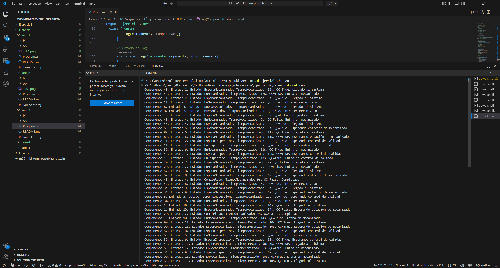

# Ejercicio 2 - Tarea 3

## Descripción

En esta tarea se aumenta el flujo de entrada de la planta hasta un total de 20 componentes, manteniendo una llegada de un nuevo componente cada 2 segundos.

El objetivo es comprobar qué ocurre cuando la línea empieza a saturarse y las 4 estaciones de mecanizado no son suficientes para absorber inmediatamente todos los componentes que llegan.

Cuando todas las estaciones están ocupadas, los componentes deben permanecer en estado `EsperaMecanizado` hasta que una estación quede libre. :contentReference[oaicite:5]{index=5}

---

## Objetivo del programa

El objetivo de esta tarea es simular una situación de saturación del sistema de producción y analizar el comportamiento de la cola de espera en mecanizado.

Con esta simulación se busca:

- aumentar la carga de trabajo del sistema,
- comprobar cómo se gestionan los componentes cuando no hay estaciones libres,
- mantener el control de calidad para los componentes que lo necesiten,
- observar si los componentes que esperan entran luego en mecanizado por orden de llegada o no.

---

## Requisitos del enunciado

En esta tarea se pide:

- aumentar el flujo a **20 componentes**,
- hacer que llegue **uno cada 2 segundos**,
- y que, si las 4 estaciones de mecanizado están ocupadas, los componentes permanezcan en estado `EsperaMecanizado` hasta que una estación quede libre. :contentReference[oaicite:6]{index=6}

Además, el enunciado pregunta:

- cómo se ha planteado la solución,
- qué otra alternativa podría haberse implementado,
- y si los componentes que esperan entran luego a mecanizado por orden de llegada. :contentReference[oaicite:7]{index=7}

---

## Estructura del programa

El programa se divide en tres partes principales.

### Enumeración de estados

Se utiliza una enumeración para representar los estados posibles del componente durante la simulación:

- EsperaMecanizado
- EnMecanizado
- EsperaInspeccion
- EnInspeccion
- Completado

Esto mejora la legibilidad del código y facilita el seguimiento del proceso.

---

### Clase Componente

La clase `Componente` representa cada pieza que entra en la planta.

Cada componente contiene:

- **Id**: identificador único aleatorio entre 1 y 100.
- **TiempoMecanizado**: tiempo de mecanizado aleatorio entre 5 y 15 segundos.
- **RequiereInspeccion**: indica si debe pasar por control de calidad.
- **Estado**: estado actual del componente.
- **OrdenLlegada**: número de orden de entrada en la fábrica.

---

### Clase principal del programa

La clase principal gestiona toda la simulación y define:

- las 4 estaciones de mecanizado,
- las 2 máquinas de control de calidad,
- el generador aleatorio,
- un conjunto de IDs ya utilizados para evitar repeticiones,
- varios bloqueos para proteger recursos compartidos,
- y los hilos que procesan los 20 componentes.

---

## Funcionamiento de la simulación

El funcionamiento del programa es el siguiente:

1. Se generan 20 componentes.
2. Cada componente llega al sistema con una separación de 2 segundos respecto al anterior.
3. Al llegar, cada componente recibe:
   - un ID único,
   - un tiempo de mecanizado aleatorio,
   - y un valor aleatorio que indica si requiere inspección.
4. Si hay una estación de mecanizado libre, el componente entra directamente.
5. Si todas las estaciones están ocupadas, el componente queda en estado `EsperaMecanizado` hasta que una estación se libera.
6. Una vez dentro, pasa al estado `EnMecanizado` y permanece el tiempo indicado por `TiempoMecanizado`.
7. Si el componente requiere inspección:
   - pasa al estado `EsperaInspeccion`,
   - espera una máquina de QC libre,
   - entra en estado `EnInspeccion`,
   - y permanece 15 segundos en control de calidad.
8. Finalmente, el componente pasa al estado `Completado`.

---

## Sincronización utilizada

La solución utiliza semáforos para controlar el acceso a los recursos compartidos de la planta.

### Estaciones de mecanizado

Se utiliza un `SemaphoreSlim` con capacidad 4 para representar las 4 estaciones de mecanizado.

Esto permite que solo 4 componentes puedan mecanizarse al mismo tiempo.

### Máquinas de QC

Se utiliza otro `SemaphoreSlim` con capacidad 2 para representar las 2 máquinas de control de calidad.

Esto permite que solo 2 componentes puedan estar en inspección simultáneamente.

### Bloqueos auxiliares

También se utilizan bloqueos (`lock`) para:

- proteger el generador de números aleatorios,
- evitar que se repitan IDs,
- y asegurar que la salida por consola no se mezcle entre varios hilos.

---

## Explicación del planteamiento

La solución elegida consiste en dejar que todos los componentes compitan por una estación libre de mecanizado.

Si no hay estaciones disponibles, el componente permanece esperando y vuelve a intentarlo periódicamente hasta que una estación queda libre.

Este enfoque es sencillo de implementar y permite simular claramente el comportamiento de saturación del sistema sin añadir estructuras demasiado complejas.

Además, mantiene el paralelismo natural de la planta, tanto en mecanizado como en control de calidad.

---

## Respuesta a la pregunta del enunciado

### ¿Los componentes que deben esperar entran luego a la consulta por orden de llegada? Explica qué tipo de pruebas has realizado para comprobar este comportamiento.

No necesariamente.

En esta implementación, los componentes que esperan una estación de mecanizado no se gestionan mediante una cola FIFO estricta, sino que compiten por el acceso a una estación libre mediante intentos repetidos con un semáforo.

Esto significa que, cuando una estación queda libre, no siempre entra primero el componente que llevaba más tiempo esperando. El orden depende del momento exacto en que cada hilo vuelve a intentar acceder al semáforo y de cómo el sistema operativo planifica su ejecución.

Para comprobar este comportamiento se pueden realizar las siguientes pruebas:

- ejecutar el programa varias veces,
- observar el orden de llegada de los componentes,
- fijarse en cuáles entran en `EsperaMecanizado`,
- comparar ese orden con el orden en que pasan después a `EnMecanizado`.

Estas pruebas permiten comprobar que el orden de entrada a mecanizado no está garantizado por orden de llegada en esta solución.

---

## Visualización del avance

El programa muestra por consola información completa del componente durante toda la simulación.

En cada mensaje se indica:

- el identificador del componente,
- el número de entrada,
- el estado actual,
- el tiempo de mecanizado,
- si requiere QC,
- y un mensaje descriptivo del evento.

Esto permite seguir el recorrido completo de cada componente y detectar fácilmente cuándo se produce saturación en el sistema.

---

## Captura de ejecución

