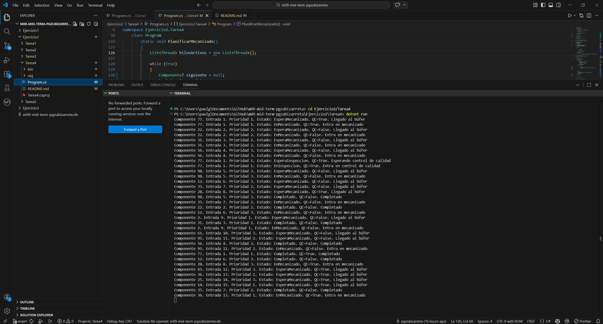
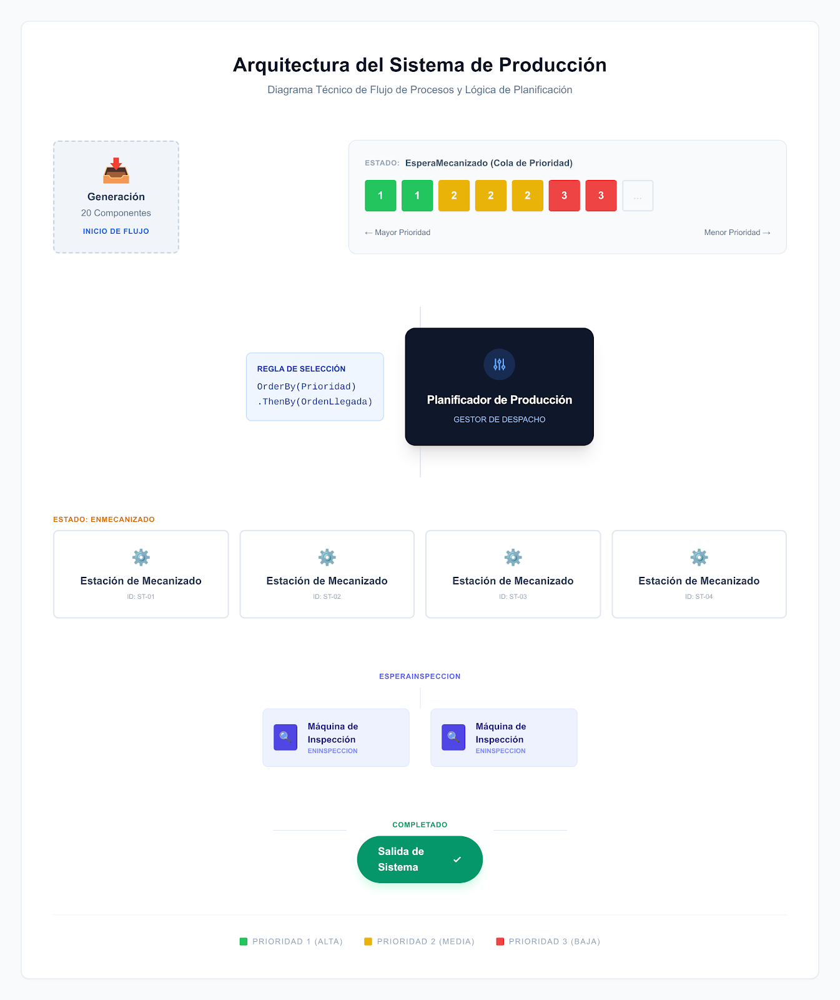

# Ejercicio 2 - Tarea 4

## Descripción

En esta tarea se modifica la gestión del búfer de entrada para que los componentes no entren a mecanizado solo según disponibilidad, sino siguiendo un criterio de prioridad.

Cada componente recibe al llegar una prioridad aleatoria entre 1 y 3:

- Prioridad 1: máxima prioridad
- Prioridad 2: prioridad media
- Prioridad 3: prioridad baja

Los componentes en espera deben entrar en las estaciones de mecanizado por orden de prioridad. Si varios componentes tienen la misma prioridad, se respeta su orden de llegada. :contentReference[oaicite:3]{index=3}

---

## Objetivo del programa

El objetivo de esta tarea es implementar una gestión del búfer basada en prioridades, simulando un entorno en el que algunos pedidos son más urgentes que otros.

Con esta solución se busca:

- mantener el flujo de llegada de componentes,
- almacenar temporalmente los componentes en un búfer,
- seleccionar el siguiente componente a mecanizar según prioridad,
- respetar el orden de llegada cuando hay empate de prioridad,
- mantener también la fase de control de calidad para los componentes que lo necesiten.

---

## Requisitos del enunciado

En esta tarea se pide lo siguiente:

- al llegar al búfer de entrada, se asigna una prioridad 1, 2 o 3;
- los componentes en espera entrarán a mecanizado por orden de prioridad;
- si tienen la misma prioridad, se respetará el orden de llegada. :contentReference[oaicite:4]{index=4}

---

## Estructura del programa

El programa se divide en varias partes principales.

### Enumeración de estados

Se utiliza una enumeración para representar los estados posibles del componente:

- EsperaMecanizado
- EnMecanizado
- EsperaInspeccion
- EnInspeccion
- Completado

Esto facilita el seguimiento de cada componente durante la simulación.

---

### Clase Componente

La clase `Componente` representa cada pieza que entra en la planta.

Cada componente contiene:

- **Id**: identificador único aleatorio.
- **TiempoMecanizado**: tiempo de mecanizado aleatorio entre 5 y 15 segundos.
- **RequiereInspeccion**: indica si debe pasar control de calidad.
- **Estado**: estado actual del componente.
- **OrdenLlegada**: orden de entrada en la fábrica.
- **Prioridad**: prioridad asignada al llegar al búfer.

---

### Búfer de entrada

Se utiliza una lista compartida como búfer para almacenar los componentes que todavía no han entrado en mecanizado.

Los componentes permanecen en este búfer hasta que el planificador selecciona cuál debe entrar en una estación libre.

---

### Planificador

Se crea un hilo planificador encargado de decidir qué componente entra a mecanizado.

Cada vez que hay una estación libre, el planificador selecciona del búfer el componente que cumple estas reglas:

1. menor valor de prioridad;
2. en caso de empate, menor orden de llegada.

De este modo se garantiza exactamente el comportamiento pedido en el enunciado.

---

## Funcionamiento de la simulación

El programa sigue estos pasos:

1. Se inicia un hilo planificador.
2. Se generan 20 componentes, uno cada 2 segundos.
3. Cada componente recibe:
   - un ID único,
   - un tiempo de mecanizado aleatorio,
   - un valor aleatorio que indica si requiere QC,
   - una prioridad entre 1 y 3.
4. El componente se añade al búfer de entrada.
5. Cuando hay una estación libre, el planificador selecciona del búfer el componente con mayor prioridad.
6. Si varios componentes tienen la misma prioridad, entra primero el que llegó antes.
7. El componente pasa a `EnMecanizado` y permanece el tiempo indicado.
8. Si necesita inspección:
   - pasa a `EsperaInspeccion`,
   - espera una máquina de QC libre,
   - pasa a `EnInspeccion`,
   - permanece 15 segundos en QC.
9. Finalmente pasa a `Completado`.

---

## Sincronización utilizada

La solución utiliza varios mecanismos de sincronización.

### Búfer compartido

El búfer se protege con `lock` para evitar accesos simultáneos incorrectos.

### Control de estaciones libres

Se utiliza una variable compartida para indicar cuántas estaciones de mecanizado están disponibles.

### Control de calidad

Las máquinas de QC se representan con un `SemaphoreSlim(2, 2)`, lo que permite que como máximo dos componentes estén en inspección a la vez.

### Protección de recursos compartidos

También se utilizan bloqueos para:

- proteger la consola,
- proteger el generador aleatorio,
- evitar IDs repetidos,
- sincronizar el estado de finalización de la generación.

---

## Explicación del planteamiento

La solución elegida se basa en separar claramente dos funciones:

- la generación de componentes,
- y la planificación de entrada a mecanizado.

Los componentes se almacenan primero en un búfer de entrada. Después, un hilo planificador revisa continuamente ese búfer y escoge el siguiente componente según prioridad y orden de llegada.

He escogido esta solución porque representa bien la idea de una cola priorizada de fábrica y permite controlar de forma sencilla qué componente entra a mecanizado en cada momento.

Además, hace que la lógica de prioridad quede muy visible y fácil de explicar.

---

## Visualización del avance

El programa muestra por consola información detallada de cada componente, incluyendo:

- el identificador,
- el orden de llegada,
- la prioridad,
- el estado actual,
- si necesita control de calidad,
- y un mensaje descriptivo del evento.

Esto permite comprobar fácilmente si los componentes entran a mecanizado respetando la prioridad.

---

## Captura de ejecución

---

# Diagrama/Esquema

