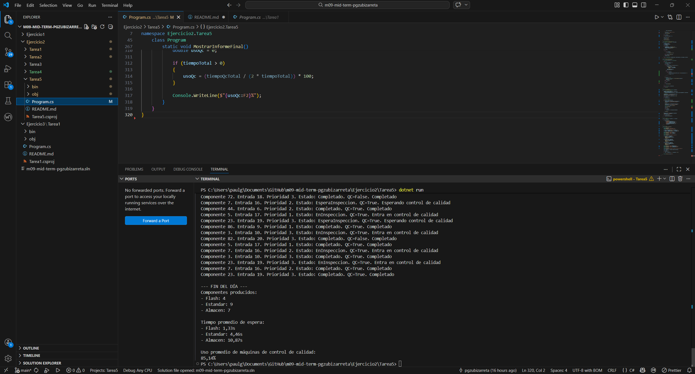

# Ejercicio 2 - Tarea 5

## Descripción

En esta tarea se añade un informe final de producción al terminar la simulación.

El objetivo es obtener estadísticas globales del comportamiento del sistema durante toda la jornada de trabajo, utilizando la simulación desarrollada en las tareas anteriores.

El informe debe mostrar:

- el total de componentes procesados por cada tipo de prioridad,
- el tiempo promedio de espera en el búfer,
- y el porcentaje de uso medio de las máquinas de control de calidad. 

Estos son exactamente los datos que pide el enunciado. :contentReference[oaicite:6]{index=6}

---

## Objetivo del programa

El objetivo de esta tarea es complementar la simulación de producción con un resumen estadístico final.

Con ello se pretende:

- medir cuántos componentes se han procesado de cada tipo de prioridad,
- calcular el tiempo medio que cada grupo ha esperado en el búfer,
- analizar el nivel de utilización de las máquinas de control de calidad,
- y ofrecer una visión global del comportamiento del sistema al final del día.

---

## Requisitos del enunciado

El enunciado pide generar al finalizar la simulación un reporte estadístico con:

- total de componentes procesados por cada tipo de prioridad,
- tiempo promedio de espera en el búfer por componente,
- porcentaje de uso promedio de las máquinas de control de calidad. :contentReference[oaicite:7]{index=7}

Además, incluye un ejemplo de salida con los nombres:

- Flash
- Estandar
- Almacen :contentReference[oaicite:8]{index=8}

Por ese motivo, en esta solución las prioridades numéricas se presentan con esos nombres.

---

## Estructura del programa

El programa mantiene la estructura general de la tarea anterior, pero añade almacenamiento de datos estadísticos y un informe final.

### Enumeración de estados

Se utiliza una enumeración para representar los estados posibles del componente:

- EsperaMecanizado
- EnMecanizado
- EsperaInspeccion
- EnInspeccion
- Completado

---

### Clase Componente

La clase `Componente` representa cada pieza de la línea de producción.

Cada componente contiene:

- **Id**: identificador único.
- **TiempoMecanizado**: tiempo de mecanizado aleatorio entre 5 y 15 segundos.
- **RequiereInspeccion**: indica si debe pasar por QC.
- **Estado**: estado actual del proceso.
- **OrdenLlegada**: orden de entrada en la fábrica.
- **Prioridad**: prioridad asignada al llegar al búfer.
- **InstanteLlegadaBuffer**: momento en que entra en el búfer.
- **InstanteInicioMecanizado**: momento en que comienza el mecanizado.
- **TiempoEsperaBuffer**: tiempo total de espera en el búfer.

Estos últimos campos se utilizan para calcular las estadísticas finales.

---

### Búfer de entrada

Los componentes se almacenan en un búfer mientras esperan una estación de mecanizado libre.

El acceso a este búfer se protege con `lock` para evitar errores de concurrencia.

---

### Planificador

Se utiliza un hilo planificador para seleccionar qué componente entra a mecanizado.

El criterio de selección es:

1. prioridad más alta,
2. en caso de empate, menor orden de llegada.

Esto mantiene la lógica de la Tarea 4.

---

### Lista de componentes completados

Cuando un componente termina todo su recorrido, se guarda en una lista de completados.

Esta lista se utiliza al final para calcular:

- el número de componentes por prioridad,
- el tiempo medio de espera por prioridad.

---

### Medición del uso de QC

Cada vez que un componente entra en control de calidad, se mide cuánto tiempo permanece ocupando una máquina de QC.

La suma de todos esos tiempos se compara con el tiempo total de la simulación y con el número de máquinas disponibles para obtener el porcentaje medio de uso.

---

## Funcionamiento de la simulación

El programa sigue estos pasos:

1. Se inicia un cronómetro global.
2. Se lanza un hilo planificador.
3. Se generan 20 componentes, uno cada 2 segundos.
4. Cada componente recibe:
   - un ID aleatorio único,
   - un tiempo de mecanizado,
   - un valor aleatorio que indica si necesita QC,
   - una prioridad entre 1 y 3.
5. Cada componente entra en el búfer de espera.
6. El planificador selecciona el siguiente componente según prioridad y orden de llegada.
7. Antes de entrar en mecanizado, se calcula cuánto tiempo ha esperado en el búfer.
8. Si requiere inspección:
   - espera una máquina libre,
   - entra en QC,
   - permanece 15 segundos en inspección.
9. Cuando termina, el componente se añade a la lista de completados.
10. Al final de la simulación se genera el informe de fin de día.

---

## Informe final generado

El informe muestra tres bloques de información.

### 1. Componentes producidos

Se cuenta cuántos componentes se han completado de cada tipo:

- Flash
- Estandar
- Almacen

Estos nombres corresponden a las prioridades definidas en el documento del ejercicio. :contentReference[oaicite:9]{index=9}

---

### 2. Tiempo promedio de espera

Se calcula la media del tiempo de espera en búfer para cada grupo de prioridad.

Aunque el enunciado menciona el tiempo de espera por componente, el ejemplo oficial lo presenta agrupado por tipo de prioridad, por lo que esta solución sigue ese mismo formato. :contentReference[oaicite:10]{index=10}

---

### 3. Uso promedio de máquinas de QC

Se calcula con esta idea:

- sumar el tiempo total de ocupación de las máquinas de control de calidad,
- dividirlo entre el tiempo máximo disponible de las 2 máquinas durante toda la simulación,
- convertir el resultado a porcentaje.

De esta forma se obtiene un indicador del grado de utilización del sistema de inspección.

---

## Explicación del planteamiento

He decidido hacerlo así porque permite aprovechar toda la estructura de simulación ya construida en las tareas anteriores y añadir una capa de medición sin cambiar el comportamiento principal del sistema.

La idea es sencilla:

- cada componente guarda información temporal sobre su espera,
- al terminar se almacena en una lista de completados,
- y al final se recorren esos datos para producir el informe.

He escogido esta solución porque es clara, fácil de entender y permite calcular el reporte final de forma directa.

---

## Respuesta a la pregunta del enunciado

### ¿Puedes explicar tu código y por qué has decidido hacerlo así?

Sí.

El código mantiene un búfer de entrada con prioridades, un planificador que decide qué componente entra a mecanizado y un sistema de control de calidad con dos máquinas compartidas.

Además de procesar los componentes, cada uno registra su instante de llegada al búfer y el instante en que comienza el mecanizado. Con esa diferencia se obtiene su tiempo de espera.

Cuando el componente termina, se guarda en una lista de completados. Al final del programa, esa lista se utiliza para calcular cuántos componentes se han producido de cada tipo, cuál ha sido su tiempo medio de espera y cuál ha sido el uso medio del área de control de calidad.

He decidido hacerlo así porque separa bien tres responsabilidades:

- simulación del proceso,
- recogida de datos,
- generación del informe final.

Esto hace que el programa sea más fácil de entender, más fácil de mantener y más fácil de explicar de forma oral.

---

## Captura de ejecución

