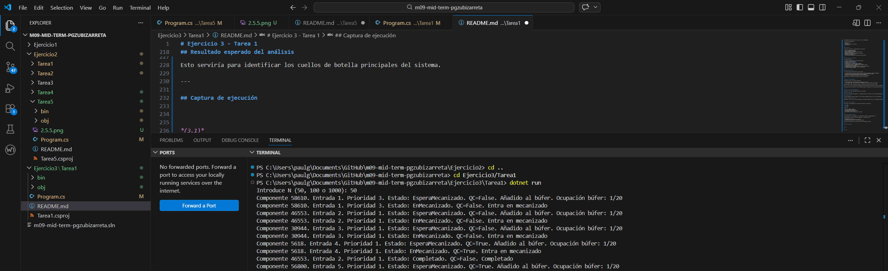
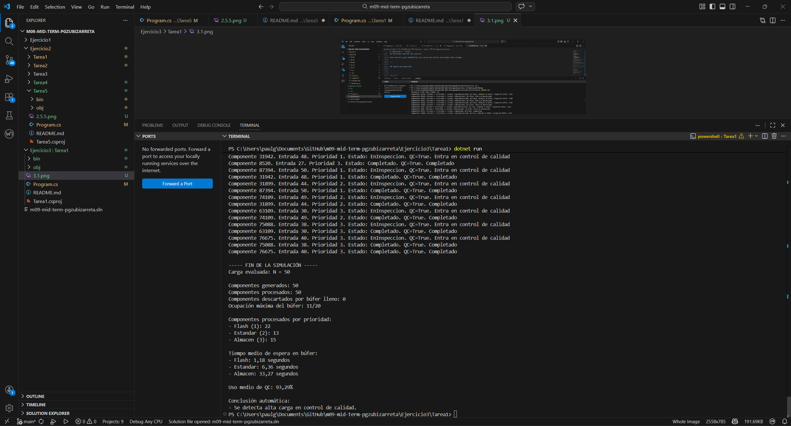

# Ejercicio 3 - Tarea 1

## Descripción

En esta tarea se debe simular una producción continua mediante un hilo **Generador** que crea componentes de forma indefinida, uno cada 2 segundos, con datos aleatorios.

El objetivo es evaluar el comportamiento del sistema para distintas cargas de trabajo: **N = 50, 100 y 1000** componentes. También se deben observar posibles cuellos de botella o problemas de sincronización. :contentReference[oaicite:2]{index=2}

La planta mantiene la estructura general de la práctica:

- un **búfer de entrada** con capacidad física de **20 unidades**,
- **4 estaciones de mecanizado**,
- **2 máquinas de control de calidad**,
- y prioridades de lote 1, 2 y 3. :contentReference[oaicite:3]{index=3}

---

## Objetivo del programa

El objetivo del programa es simular una producción continua bajo carga y analizar cómo responde la planta cuando se incrementa el número de componentes generados.

Con esta solución se pretende:

- crear componentes automáticamente cada 2 segundos,
- introducirlos en un búfer limitado,
- procesarlos por prioridad,
- enviarlos a control de calidad si lo necesitan,
- y generar un informe final que permita detectar saturaciones o cuellos de botella.

---

## Requisitos del enunciado

El enunciado pide:

- crear un hilo **Generador**,
- generar un nuevo componente cada 2 segundos,
- asignar datos aleatorios de prioridad, tiempo de proceso y necesidad de QC,
- y evaluar el comportamiento del sistema para **N = 50, 100 y 1000** componentes, identificando posibles cuellos de botella o errores de sincronización. :contentReference[oaicite:4]{index=4}

---

## Estructura del programa

El programa se divide en varias partes.

### Enumeración de estados

Se utiliza una enumeración para representar los estados del componente:

- EsperaBuffer
- EsperaMecanizado
- EnMecanizado
- EsperaInspeccion
- EnInspeccion
- Completado

---

### Clase Componente

Cada componente contiene:

- **Id**: identificador único.
- **TiempoMecanizado**: tiempo de mecanizado aleatorio entre 5 y 15 segundos.
- **RequiereInspeccion**: indica si debe pasar por QC.
- **Prioridad**: valor 1, 2 o 3.
- **OrdenLlegada**: orden de entrada en el sistema.
- **Estado**: estado actual del proceso.

Además, se guardan marcas temporales para calcular tiempos de espera en el búfer.

---

### Hilo Generador

El hilo generador crea componentes automáticamente hasta alcanzar el valor N seleccionado por el usuario.

Cada 2 segundos:

1. crea un componente con datos aleatorios,
2. intenta insertarlo en el búfer,
3. si el búfer está lleno, el componente se descarta y se registra el evento.

---

### Búfer de entrada

Se utiliza una lista compartida como búfer de entrada con capacidad máxima de 20 componentes. Esto sigue la limitación física descrita en el enunciado general de la práctica. :contentReference[oaicite:5]{index=5}

Si el búfer está lleno, el sistema no admite más componentes en ese instante.

---

### Planificador

Un hilo planificador revisa continuamente el búfer y selecciona el siguiente componente que debe entrar a mecanizado.

El criterio de selección es:

1. prioridad más alta,
2. si hay empate, menor orden de llegada.

De este modo se mantiene la lógica de prioridad desarrollada en tareas anteriores.

---

### Procesamiento

Cada componente que sale del búfer se procesa en un hilo independiente.

El recorrido del componente es:

1. espera en búfer,
2. mecanizado,
3. control de calidad si lo necesita,
4. finalización.

---

### Informe final

Al terminar la simulación, el programa genera un informe con:

- número de componentes generados,
- número de componentes procesados,
- número de componentes descartados por búfer lleno,
- ocupación máxima del búfer,
- distribución de componentes procesados por prioridad,
- tiempo medio de espera en búfer,
- uso medio de las máquinas QC,
- y una conclusión automática sobre posibles cuellos de botella.

---

## Funcionamiento de la simulación

El programa funciona así:

1. El usuario indica la carga a evaluar: 50, 100 o 1000.
2. Se inicia el cronómetro global.
3. Se lanza el hilo **Generador**.
4. Se lanza el hilo **Planificador**.
5. El generador crea un componente cada 2 segundos.
6. Si hay sitio en el búfer, el componente entra en cola.
7. El planificador selecciona componentes del búfer según prioridad.
8. Los componentes pasan a mecanizado.
9. Si requieren inspección, esperan y pasan a una de las 2 máquinas de QC.
10. Cuando terminan, se almacenan en la lista de completados.
11. Al final se imprime el informe.

---

## Sincronización utilizada

La solución utiliza varios mecanismos de sincronización:

- `lock` para proteger el búfer, la consola, los IDs, la lista de completados y variables compartidas.
- `SemaphoreSlim(2, 2)` para limitar el acceso a las 2 máquinas de control de calidad.
- un planificador separado para gestionar la entrada a mecanizado.
- contadores y variables globales protegidas para evitar inconsistencias.

Esto permite que la simulación concurrente funcione de forma estable.

---

## Explicación del planteamiento

He decidido resolverlo con dos hilos principales:

- un hilo generador, que se dedica a producir componentes a ritmo fijo,
- y un hilo planificador, que se encarga de sacar componentes del búfer y asignarlos a mecanizado.

Este planteamiento separa claramente la entrada de trabajo del procesamiento interno del sistema.

Además, el uso de un búfer limitado permite observar de forma realista qué ocurre cuando la carga de llegada supera la capacidad de absorción de la planta.

He escogido esta solución porque es fácil de entender, mantiene la coherencia con los ejercicios anteriores y permite detectar con claridad situaciones de saturación.

---

## Posibles cuellos de botella esperados

Al evaluar N = 50, 100 y 1000 pueden aparecer varios problemas:

### Saturación del búfer

Como el búfer solo admite 20 componentes, si el generador produce más rápido de lo que la planta puede absorber, algunos componentes serán descartados.

### Saturación de QC

Si muchos componentes requieren inspección, las 2 máquinas de QC pueden convertirse en un cuello de botella.

### Aumento de tiempos de espera

A medida que crece la carga, es normal que aumente el tiempo medio de espera en el búfer, especialmente para componentes de prioridad baja.

---

## Qué observar en las pruebas

Para analizar el comportamiento del sistema conviene ejecutar el programa con:

- **N = 50**
- **N = 100**
- **N = 1000**

Y observar:

- si el búfer llega a llenarse,
- cuántos componentes se descartan,
- cómo cambia el tiempo medio de espera,
- si QC presenta un uso muy alto,
- y si aparecen errores o inconsistencias en consola.

---

## Resultado esperado del análisis

En cargas pequeñas como 50 componentes, el sistema debería comportarse razonablemente bien.

En cargas medias y altas, como 100 y 1000 componentes, es probable observar:

- mayor espera en el búfer,
- más presión sobre las estaciones de mecanizado,
- y posible saturación del búfer o del control de calidad.

Esto serviría para identificar los cuellos de botella principales del sistema.

---

## Captura de ejecución

---

